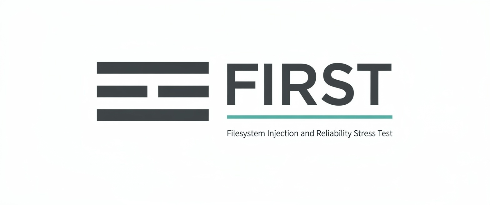

<p align="center">
  
</p>

<h1 align="center">FIRST</h1>

<p align="center">
  <strong>Deterministic crash testing for storage engines</strong><br>
  <sub>Filesystem Injection and Reliability Stress Test</sub>
</p>

<p align="center">
  <a href="docs/design.md">Design</a> •
  <a href="docs/limitations.md">Limitations</a> •
  <a href="examples/">Examples</a>
</p>

---

## What is FIRST?

FIRST tests what happens when your storage system crashes. It injects crashes at precise points in your code, restarts, runs recovery, and validates invariants — deterministically and reproducibly.

```rust
first::test()
    .run(|env| {
        let mut wal = Wal::open(&env.path("wal")).unwrap();
        let tx = wal.begin();
        wal.put(tx, "key", "value");
        first::crash_point("before_commit");
        wal.commit(tx);
    })
    .verify(|env, _crash| {
        let wal = Wal::open(&env.path("wal")).unwrap();
        // Invariant: uncommitted data must not be visible
        assert!(wal.get("key").is_none() || wal.get("key") == Some("value"));
    })
    .execute();
```

## Why FIRST?

Real crashes don't happen at function boundaries. They happen:
- After `write()` but before `fsync()`
- After appending to WAL but before the commit marker
- After `rename()` but before directory sync

Traditional tests don't catch these. FIRST does.

| Traditional Testing | FIRST |
|---------------------|-------|
| Tests happy paths | Tests crash paths |
| Random fault injection | Deterministic crash points |
| Failures are flaky | Every failure is reproducible |
| Recovery rarely exercised | Recovery runs after every crash |

## Quick Start

```toml
# Cargo.toml
[dev-dependencies]
first = "0.1"
```

```rust
// tests/my_crash_test.rs
#[test]
fn test_atomicity() {
    first::test()
        .run(|env| {
            // Your workload with crash_point() calls
        })
        .verify(|env, crash| {
            // Recovery + invariant checks
        })
        .execute();
}
```

```bash
cargo test
```

## How It Works

```
┌─────────────┐     ┌─────────────┐     ┌─────────────┐
│ Orchestrator│────▶│  Execution  │────▶│   Verify    │
│  (Parent)   │     │   (Child)   │     │   (Child)   │
└─────────────┘     └─────────────┘     └─────────────┘
      │                   │                    │
      │             SIGKILL at              Recovery +
      │            crash_point()           Invariants
      │                   │                    │
      └───────────────────┴────────────────────┘
            Repeat for each crash point
```

1. **Execution**: Your workload runs until hitting the target crash point → `SIGKILL`
2. **Verify**: Fresh process opens the preserved filesystem state, runs recovery, checks invariants
3. **Iterate**: Repeat for each crash point discovered

## Example Output

```
[first] crash point 1: OK
[first] crash point 2: OK
[first] crash point 3: FAILED (see /tmp/first/run_3)
[first] crash label: "after_commit_write"
[first] to reproduce:
  FIRST_PHASE=VERIFY FIRST_CRASH_TARGET=3 FIRST_WORK_DIR=/tmp/first/run_3 \
  cargo test my_test -- --exact
```

## Key Features

| Feature | Description |
|---------|-------------|
| **Deterministic** | Same seed/target = same crash = same failure |
| **Reproducible** | Every failure includes exact reproduction command |
| **Zero Setup** | Works with `cargo test`, no kernel modules or VMs |
| **Invariant-Based** | Assert properties, not expected outputs |
| **Artifact Preservation** | Filesystem state preserved on failure for debugging |

## Limitations (v0.1)

- Linux only
- Single-threaded execution
- Explicit crash points (no syscall interception yet)
- One `first::test()` per `#[test]` function
- No async test support

See [docs/limitations.md](docs/limitations.md) for details.

## Project Status

**v0.1** — Core crash testing functionality complete.

- ✅ Deterministic crash injection
- ✅ Orchestrator lifecycle
- ✅ Invariant validation
- ✅ Reference WAL example
- ⬜ Syscall interception (planned v0.2)
- ⬜ Parallel execution (planned v0.2)

## Documentation

- **[Design Document](docs/design.md)** — Architecture and implementation details
- **[Limitations](docs/limitations.md)** — Known constraints and crash model
- **[Reference WAL](examples/reference_wal/)** — Complete example with crash-consistency proof

## License

Licensed under the [Apache License, Version 2.0](LICENSE).

---

<p align="center">
  <strong>FIRST</strong> — Making crash consistency testable
</p>