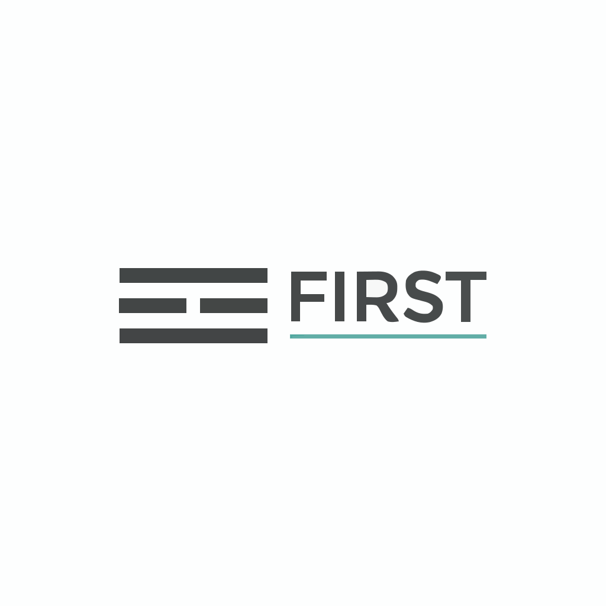

<p align="center">
  
</p>

# FIRST

> FIRST is a deterministic crash and recovery testing framework for storage engines and WAL-based systems.

## The Problem

Modern databases and storage engines rely on strong crash-consistency guarantees.

They write data using WALs, manifests, page files, and metadata updates, then recover state after crashes by replaying logs or rebuilding in-memory structures. These recovery paths are some of the most critical — and most fragile — code in the system.

However, crash behavior is rarely tested systematically.

Across the ecosystem today:

- Unit tests validate logic assuming uninterrupted execution
- Integration tests exercise happy paths
- Benchmarks measure performance, not correctness
- Fault injection exists, but is often coarse or non-deterministic
- Crash consistency and power-loss behavior are tested ad-hoc, per project
- Storage correctness is largely enforced by tribal knowledge and past incidents

Real failures do not happen at function boundaries.

They happen:
- Between writes
- During system calls
- After data reaches the page cache but before persistence
- After a WAL append but before a commit marker
- After a rename but before directory fsync

These failure modes are difficult to reason about and easy to miss.

As a result, many storage systems ship with latent crash-consistency bugs that:
- Pass unit tests
- Pass integration tests
- Pass benchmarks
- Surface only under real crashes, often years later

Every major database eventually builds internal crash-testing and chaos infrastructure to address this.

But these solutions are:
- Reinvented independently
- Tightly coupled to internal codebases
- Hard to maintain
- Rarely exhaustive
- Not reusable across projects

There is no standard framework, shared language, or common methodology for testing crash correctness in storage systems.

**FIRST exists to fill this gap.**

---

## Why FIRST

Crash consistency failures are difficult to test because crashes are not normal execution paths.

Most testing frameworks treat crashes as rare, external events. When failures are injected, they are often:
- Random
- Non-deterministic
- Coarse-grained
- Difficult to reproduce

This makes failures hard to debug and discourages exhaustive testing.

**FIRST takes a different approach.**

FIRST treats crashes as a **first-class part of execution**.

Instead of asking:
> "Does this code work?"

FIRST asks:
> "At every possible crash point, does recovery preserve the system's invariants?"

To answer this, FIRST provides:

- **Deterministic crash injection**  
  Crashes are injected at precise, replayable points, making failures reproducible.

- **Systematic exploration**  
  Crash points are enumerated deliberately, not discovered by chance.

- **Recovery-driven testing**  
  Every crash is followed by a restart and execution of recovery logic.

- **Invariant-based validation**  
  Tests assert properties that must always hold, rather than expected outputs.

By making crashes deterministic, observable, and repeatable, FIRST turns crash consistency from an ad-hoc practice into a testable property.

This allows storage systems to reason about correctness under failure with the same rigor applied to normal execution.

---

## How It Works

FIRST operates at the **persistence boundary** between your application and the filesystem.

Here's the execution flow:

1. **Crash Injection**  
   Mark crash points explicitly with `first::crash_point("label")` or let FIRST automatically intercept persistence syscalls (write, fsync, rename).

2. **Workload Execution**  
   Your test workload runs normally until a scheduled crash point is reached, then the process terminates immediately (SIGKILL).

3. **State Preservation**  
   Filesystem state is captured exactly as it existed at crash time using copy-on-write snapshots.

4. **Restart & Recovery**  
   The process restarts, your storage system's recovery logic runs (WAL replay, index rebuild, etc.), and invariants are validated.

5. **Systematic Iteration**  
   The test repeats for each crash point discovered in the workload, exploring all meaningful failure scenarios.

**Performance:** Each crash point takes approximately 50ms to test. A typical workload with 100 operations completes in seconds to minutes, making FIRST practical for continuous integration.

**Determinism:** Given the same seed, FIRST produces identical crash sequences. Every failure is reproducible.

See [`DESIGN.md`](DESIGN.md) for detailed architecture and implementation approach.

---

## Example

Here's how you test an append-only log for crash consistency:

```rust
use first::test;

/// Test that log entries are atomic - either fully written or not visible
fn test_log_atomicity() {
    first::test()
        // Define the workload
        .run(|env| {
            let log = AppendLog::create(env.path("test.log"));
            
            log.append("entry1").expect("append failed");
            // Implicit crash point: after write() syscall
            
            first::crash_point("after_first_append");
            // Explicit crash point: test critical boundary
            
            log.sync().expect("sync failed");
            // Implicit crash point: after fsync() syscall
            
            log.append("entry2").expect("append failed");
            // Implicit crash point: after write() syscall
            
            log.sync().expect("sync failed");
            // Implicit crash point: after fsync() syscall
        })
        
        // Define recovery and validation
        .verify(|env, crash_info| {
            println!("Recovering from crash at: {:?}", crash_info);
            
            // Recovery: reopen the log (triggers internal recovery logic)
            let log = AppendLog::open(env.path("test.log"))
                .expect("log should always be recoverable");
            
            let entries = log.read_all();
            
            // Invariant: Atomicity - entries are all-or-nothing
            match entries.len() {
                0 => {
                    // Crashed before first sync - no data persisted
                    assert!(entries.is_empty());
                },
                1 => {
                    // Crashed after first sync, before second
                    assert_eq!(entries, vec!["entry1"]);
                },
                2 => {
                    // Crashed after both syncs - all data persisted
                    assert_eq!(entries, vec!["entry1", "entry2"]);
                },
                _ => {
                    // Partial write visible - atomicity violated!
                    panic!("Invalid state after recovery: {:?}", entries);
                }
            }
            
            // Additional invariants
            assert!(log.verify_checksums(), "Checksums must be valid");
            assert!(log.is_well_formed(), "Log structure must be consistent");
        });
}
```

**What this test does:**

- Executes the workload with 5 crash points (2 explicit + 3 implicit from syscalls)
- For each crash point, terminates the process and preserves filesystem state
- Restarts and runs recovery logic
- Validates that invariants hold after recovery
- Reports violations with exact crash point for reproduction

**Example failure report:**

```
FIRST Test Failure
═══════════════════════════════════════════════
Test: test_log_atomicity
Crash Point: 3 ("after_first_append")
Seed: 42

Invariant Violation:
  Partial write detected - entry1 has incomplete data
  Expected: valid checksum
  Actual: checksum mismatch (0x00000000)

Filesystem state preserved at: /tmp/first/crash_3/

Reproduce:
  $ FIRST_SEED=42 FIRST_CRASH_POINT=3 cargo test test_log_atomicity
═══════════════════════════════════════════════
```

This reproducibility transforms intermittent production bugs into debuggable test failures.

---

## Performance

FIRST is designed for continuous integration and fast feedback:

| Workload | Crash Points | Test Time (Sequential) | Test Time (8 cores) |
|----------|--------------|------------------------|---------------------|
| Simple log (10 operations) | ~30 | 1.5 seconds | 0.3 seconds |
| Medium DB (100 operations) | ~300 | 15 seconds | 2 seconds |
| Complex LSM (1000 operations) | ~500 | 25 seconds | 4 seconds |

**Key characteristics:**

- **Linear scaling**: O(N) where N = number of crash points
- **Per-point overhead**: ~50ms on tmpfs (in-memory filesystem)
- **Parallel execution**: Near-linear speedup on multi-core systems
- **Practical for CI**: Most tests complete in seconds to minutes

State space exploration is **bounded and systematic**, not exhaustive. FIRST focuses on high-value crash boundaries (fsync, rename, multi-step operations) rather than attempting to test every possible execution interleaving.

See [`DESIGN.md § State Space and Performance`](DESIGN.md#7-state-space-and-performance) for detailed analysis.

---

## How FIRST Differs from Existing Tools

FIRST fills a specific gap in the crash testing ecosystem:

| Tool | **FIRST** | CrashMonkey | Jepsen | dm-flakey | FoundationDB Sim |
|------|-----------|-------------|--------|-----------|------------------|
| **Target** | Storage Engines | Filesystems | Distributed Systems | Block Devices | Full System |
| **Operates At** | Application persistence boundary | Block I/O layer | Network layer | Kernel block device | Internal runtime |
| **Knowledge Level** | App-aware (WAL, manifests) | FS-aware (bio) | Black box | Block-level only | Full system |
| **Deterministic** | [YES] | [MOSTLY] | [NO] | [YES] (scriptable) | [YES] |
| **Setup Required** | `cargo test` | VM + kernel module | Cluster setup | Root + kernel module | Not extractable |
| **Recovery Testing** | [YES] Built-in | [YES] | [NO] | [LIMITED] | [YES] |
| **Open Source** | [YES] (planned) | [YES] | [YES] | [YES] | [NO] Proprietary |

**Why not use existing tools?**

- **CrashMonkey** tests filesystem implementations, not storage engines. It operates at the block I/O layer and doesn't understand application-level persistence semantics (e.g., "after WAL commit but before manifest update").

- **Jepsen** tests distributed systems by injecting network faults. FIRST tests local persistence and crash recovery—different problem domains.

- **dm-flakey** injects faults at the block device level, requiring kernel modules and root access. FIRST operates at syscall boundaries and runs as a regular user process.

- **FoundationDB's simulator** is proprietary and deeply integrated into their codebase. FIRST is designed as a reusable, open-source framework.

**FIRST's unique position:**

Unlike filesystem or distributed testing tools, FIRST understands **application-level persistence semantics** and provides **deterministic, reproducible** crash scenarios specifically for storage engine developers.

It operates where your code meets the filesystem—at the exact boundary where crash bugs happen.

---

## What FIRST Guarantees

FIRST provides guarantees about **testing behavior**, not about application correctness by itself.

Specifically, FIRST guarantees that:

- **Crashes are deterministic and replayable**  
  Given the same test, crash schedule, and seed, failures can be reproduced exactly.

- **Crash points are explicit and observable**  
  Tests run with well-defined crash boundaries rather than implicit assumptions about execution.

- **Recovery logic is always exercised**  
  Every injected crash is followed by a restart and execution of user-provided recovery code.

- **Persistent state after crashes is inspectable**  
  Filesystem state can be observed, compared, and validated after each crash.

- **Invariant violations are surfaced early**  
  Violations appear as minimal, reproducible test failures rather than intermittent production bugs.

FIRST does **not** guarantee that a system is correct.

Instead, it guarantees that:
- Crash behavior is systematically explored
- Recovery paths are continuously tested
- Violations are reproducible and debuggable

**Correctness remains the responsibility of the storage system and the invariants it defines.**

FIRST provides the testing infrastructure to verify those invariants hold under crash conditions.

---

## Non-Goals

FIRST is intentionally focused and does not attempt to solve every testing problem.

Specifically, FIRST is **not**:

- **A fuzzer or property-based testing framework**  
  FIRST prioritizes determinism and systematic exploration over randomness.

- **A performance or benchmarking tool**  
  FIRST focuses exclusively on correctness under crashes, not throughput or latency.

- **A database or storage engine**  
  FIRST provides testing infrastructure, not storage primitives or recovery logic.

- **A replacement for unit or integration tests**  
  FIRST complements existing testing by targeting crash and recovery paths.

- **A distributed systems testing framework**  
  FIRST targets local persistence and crash recovery, not network partitions or consensus failures.

These non-goals are deliberate.

By remaining narrowly scoped, FIRST aims to be reliable, predictable, and easy to integrate into existing storage systems.

---

## Project Status

FIRST is in early development, with design solidified and implementation in progress.

### Current State

**Available Now:**
- ✓ Comprehensive design document ([`DESIGN.md`](DESIGN.md))
- ✓ Core architecture defined
- ✓ API design finalized
- ✓ Implementation approach validated

**In Progress:**
- → Rust implementation (core framework)
- → Example storage systems (append-only log, simple LSM)
- → Test suite and validation

**Not Yet Available:**
- Public repository (coming soon)
- Stable release
- Language bindings (C++, Go planned for later phases)

### Development Focus

The current focus is on:
- Defining a clear and minimal core model
- Establishing deterministic crash and recovery semantics
- Validating the design through small, targeted examples

The API is intentionally unstable and subject to change during this phase.

This early stage prioritizes:
- **Correctness** over completeness
- **Clarity** over feature count
- **Design rigor** over rapid expansion

### Feedback Welcome

We're sharing the design early to gather feedback from storage and database engineers before the first public release.

Feedback is especially valuable on:
- Invariant modeling patterns
- Crash boundary selection
- Recovery semantics
- API ergonomics
- Integration with existing storage systems

---

## Roadmap

FIRST is being developed in deliberate phases.

### Phase 1 — Core Crash Testing (Current Focus)

- [x] Design document and architecture
- [ ] Deterministic crash scheduler
- [ ] Explicit crash point annotations
- [ ] Process termination and restart (SIGKILL)
- [ ] Filesystem state preservation (CoW snapshots)
- [ ] Persistent state inspection
- [ ] Minimal example storage systems
- [ ] Basic invariant validation framework

**Target:** Q2 2026

### Phase 2 — Reusable Test Harness

- [ ] Ergonomic test API refinements
- [ ] Syscall interception mode (LD_PRELOAD)
- [ ] Crash point pruning and optimization
- [ ] Parallel crash point exploration
- [ ] Improved diagnostics and failure reproduction
- [ ] Integration with `cargo test`
- [ ] Documentation and examples

**Target:** Q3 2026

### Phase 3 — Language Bindings and Ecosystem

- [ ] C/C++ bindings
- [ ] Go bindings
- [ ] Java bindings (exploratory)
- [ ] Support for Windows and macOS
- [ ] Integration with existing test frameworks
- [ ] Community examples and case studies

**Target:** Q4 2026 and beyond

The roadmap is intentionally conservative.

Features are added only when they preserve determinism, reproducibility, and clarity. Each phase builds on proven foundations from the previous phase.

---

## Contributing

FIRST is an early-stage project focused on correctness, determinism, and clear design.

Contributions are welcome, especially in the form of:
- Design feedback and architectural suggestions
- Invariant modeling ideas and patterns
- Small, focused examples of storage systems
- Documentation improvements
- Bug reports and edge case identification

### Before Contributing Code

Please open an issue to discuss your approach before submitting code.

This helps:
- Keep the core design coherent
- Avoid premature complexity
- Ensure contributions align with project goals
- Prevent duplicate or conflicting work

### Development Principles

All contributions should maintain FIRST's core principles:

1. **Determinism first** — Every failure must be reproducible
2. **Simplicity** — Prefer clarity over cleverness
3. **Focused scope** — Stay within defined boundaries
4. **Test what you build** — Demonstrate correctness
5. **Document your decisions** — Explain the "why"

See `CONTRIBUTING.md` for detailed guidelines (coming soon).

---

## Learn More

- **[Design Document](DESIGN.md)** — Comprehensive technical design, implementation details, and architectural decisions
- **[Examples](examples/)** — Reference implementations and test patterns (coming soon)
- **[API Documentation](docs/api.md)** — Detailed API reference (coming soon)
- **[FAQ](docs/faq.md)** — Common questions and answers (coming soon)

---

## License

[To be announced]

---

## Acknowledgments

FIRST builds on research in crash consistency testing, including:

- **ALICE** (OSDI '14) — Logical crash consistency checking
- **CrashMonkey** (OSDI '18) — Automated filesystem crash testing
- **AGAMOTTO** (SOSP '21) — Filesystem testing via record/replay

We're grateful to the storage systems research community for establishing the foundations that make FIRST possible.

---

<p align="center">
  <strong>FIRST</strong> — Making crash consistency testable
</p>