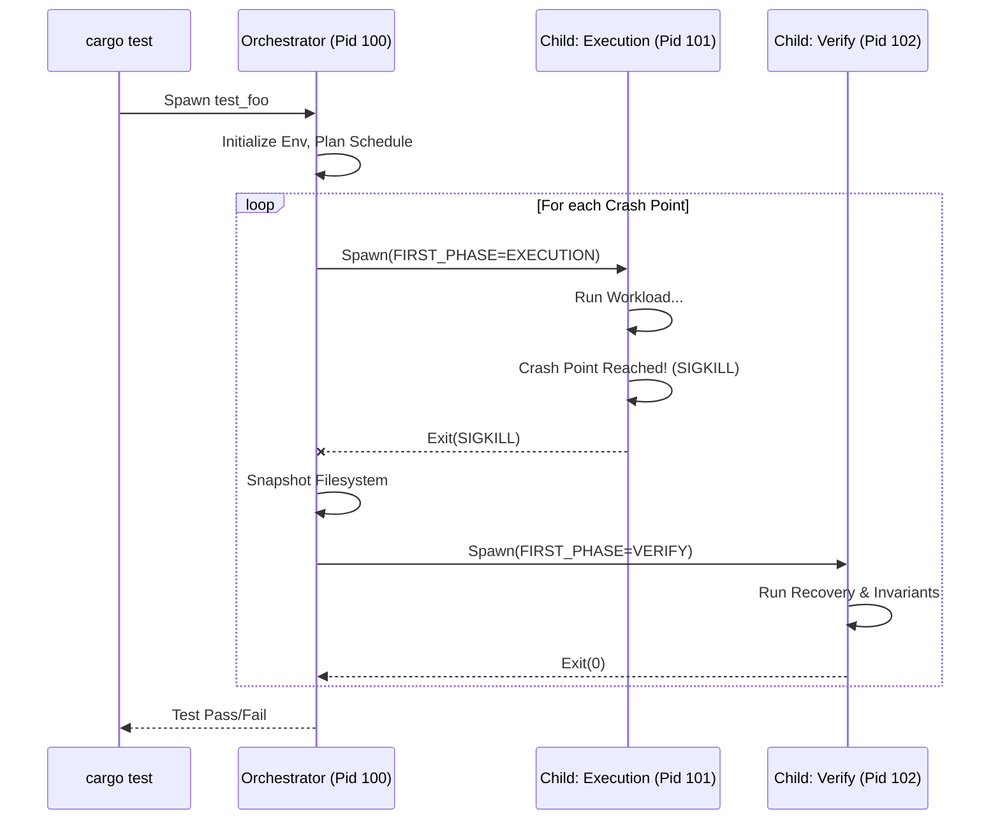

# Architecture Decision: Crate Structure and Execution Model

**Status:** Proposed
**Issue:** #1

## 1. High-Level Structure

**Decision:** `first` will be a **Library Crate**.

Users will add `first` to their `dev-dependencies`.
Tests will be written as standard Rust integration tests (in `tests/*.rs`) or unit tests.

```toml
[dev-dependencies]
first = "0.1"
```

There is no separate `first-cli` binary required to run tests. Standard `cargo test` is the interface.

## 2. Execution Model: The "Self-Spawning Supervisor"

To achieve process isolation and deterministic crashes, `first` uses a multiprocess architecture where the test binary spawns *itself*.

### Three Execution Contexts

1.  **Orchestrator (The Supervisor)**
    *   **Role:** Manages the test lifecycle, FS snapshots, and scheduling.
    *   **Trigger:** Default state when `first::test()` is called with no special env vars.
    *   **Behavior:**
        *   Does *not* run the user's workload directly.
        *   Loops through the **Crash Schedule**.
        *   For each crash point:
            1.  Prepares a fresh workspace (`/tmp/first/run_N`).
            2.  Spawns **Child: Crash Phase**.
            3.  Waits for child to exit (expected signal: SIGKILL).
            4.  Snapshots the filesystem (CoW).
            5.  Spawns **Child: Verify Phase** against the snapshot.
            6.  Reports pass/fail.

2.  **Execution Phase (The Victim)**
    *   **Role:** Runs the actual workload until it crashes.
    *   **Trigger:** `FIRST_PHASE=EXECUTION`
    *   **Behavior:**
        *   `first::test()` sees the env var and immediately executes the `.run()` closure.
        *   Ignores `.verify()` closure.
        *   `first::crash_point()` checks the global counter.
        *   If target reached -> `kill(SIGKILL, self)`.

3.  **Verification Phase (The Inspector)**
    *   **Role:** Recovers the system and checks invariants.
    *   **Trigger:** `FIRST_PHASE=VERIFY`
    *   **Behavior:**
        *   `first::test()` sees the env var.
        *   Skips `.run()` closure.
        *   Executes `.verify()` closure.
        *   Exits 0 on success, panic on failure.

### Diagram



## 3. Interface Design

### Mode Selection
We will use Environment Variables, handled internally by `first`.

*   `FIRST_PHASE`: `EXECUTION` | `VERIFY` (Default: `ORCHESTRATOR`)
*   `FIRST_CRASH_TARGET`: Integer ID of the crash point to trigger.
*   `FIRST_WORK_DIR`: Absolute path to the isolated directory for this run.

### Global State
Since crash points can be deep in the call stack, we need global state access.

*   **Location:** `first::rt` (Runtime module)
*   **Storage:** `static AtomicUsize` specific to the current process.
    *   `GLOBAL_CRASH_COUNTER`: Incremented by `crash_point()`.
    *   `TARGET_CRASH_POINT`: Loaded from env var at startup.

## 4. Addressing Constraints

*   **How does `cargo test` work with this?**
    *   `cargo test` runs the Orchestrator.
    *   The Orchestrator uses `std::env::current_exe()` to find the test binary.
    *   It re-runs the binary, filtering for the *specific test name* to avoid recursive bombs.

*   **Cleanup?**
    *   The Orchestrator owns the temp dirs. It cleans them up unless `FIRST_KEEP_ARTIFACTS=1` is set.

## 5. Recommendation

This structure keeps the API simple (`cargo test` just works) while providing the necessary isolation for crash testing.
