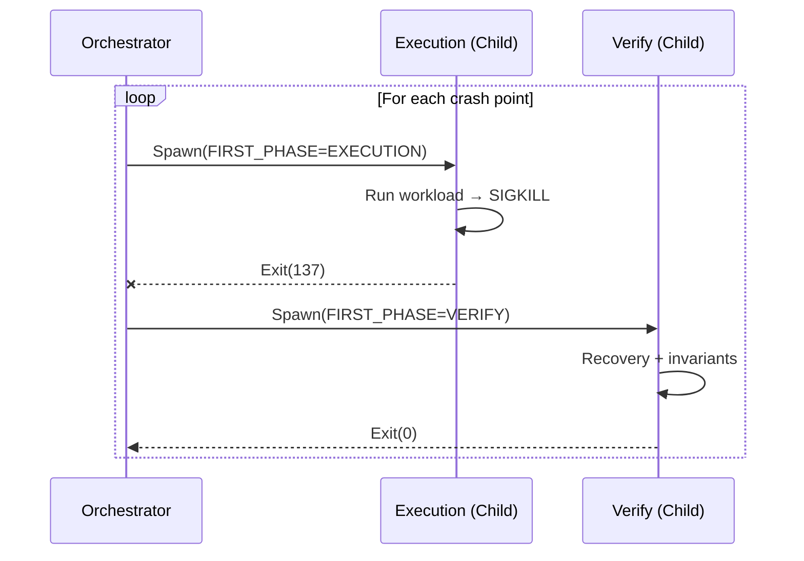

# ADR-001: Crate Structure

**Status:** Accepted

## Decision

FIRST is a **library crate** with no CLI. Users add it to `dev-dependencies` and run tests via `cargo test`.

```toml
[dev-dependencies]
first = "0.1"
```

## Execution Model

FIRST uses a **self-spawning supervisor** pattern with three execution contexts:

| Context | Trigger | Behavior |
|---------|---------|----------|
| **Orchestrator** | Default (no env vars) | Manages lifecycle, spawns children |
| **Execution** | `FIRST_PHASE=EXECUTION` | Runs `.run()`, crashes at target |
| **Verify** | `FIRST_PHASE=VERIFY` | Runs `.verify()`, checks invariants |



## Environment Variables

| Variable | Description |
|----------|-------------|
| `FIRST_PHASE` | `EXECUTION` / `VERIFY` (default: Orchestrator) |
| `FIRST_CRASH_TARGET` | Target crash point ID (1-indexed) |
| `FIRST_WORK_DIR` | Isolated directory for this run |

## Global State

Crash points require global state access:

- **Location:** `first::rt`
- **Storage:** `static AtomicUsize` for crash counter
- **Initialization:** Env vars read once at startup via `OnceLock`
